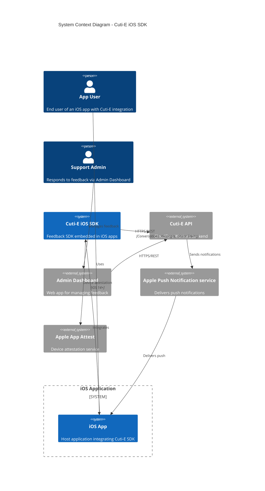
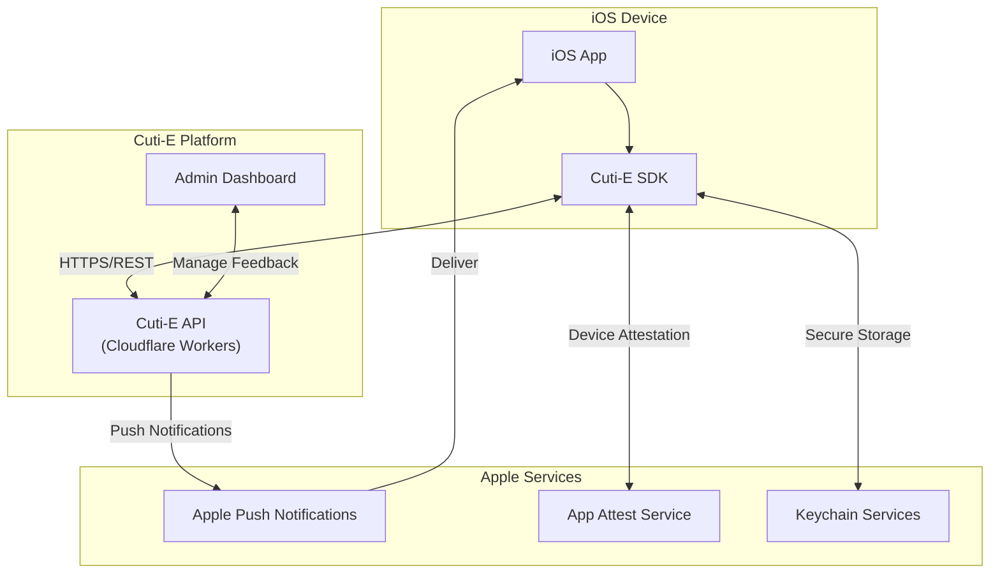
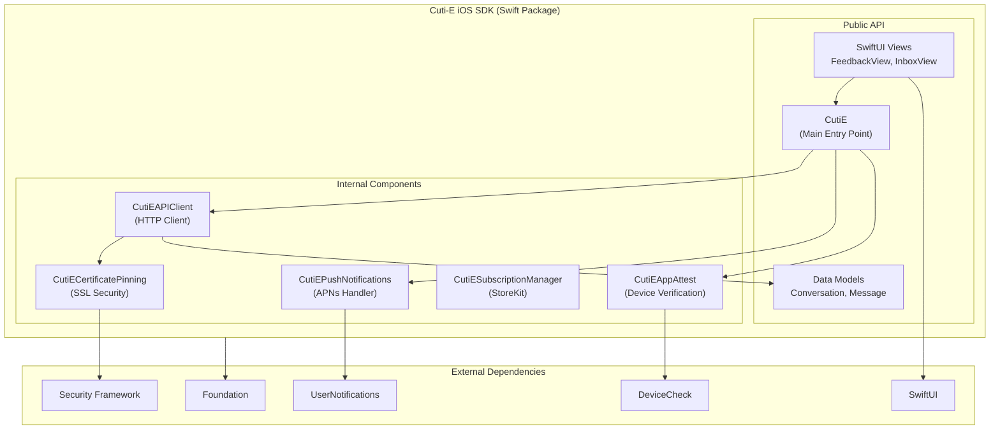
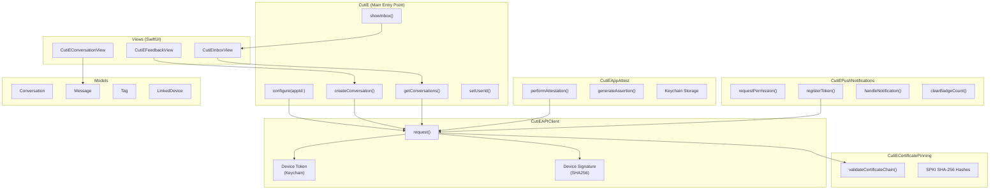
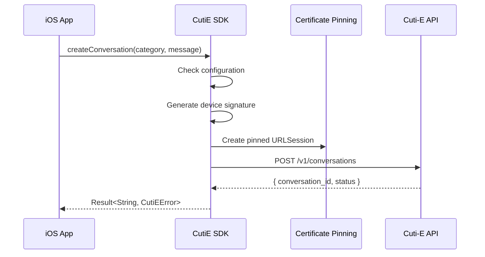
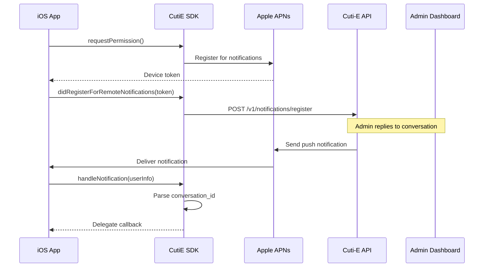
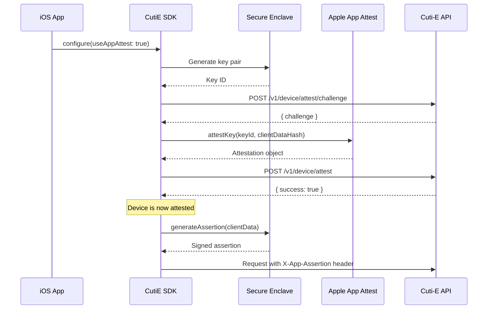
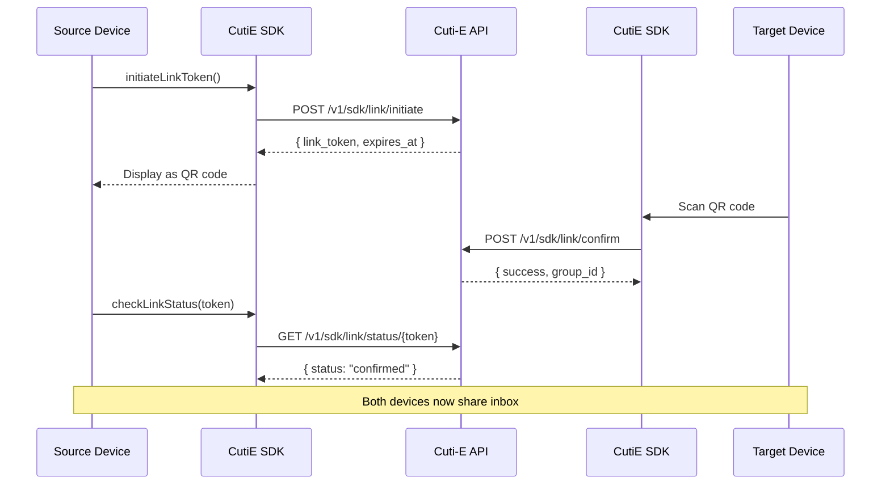
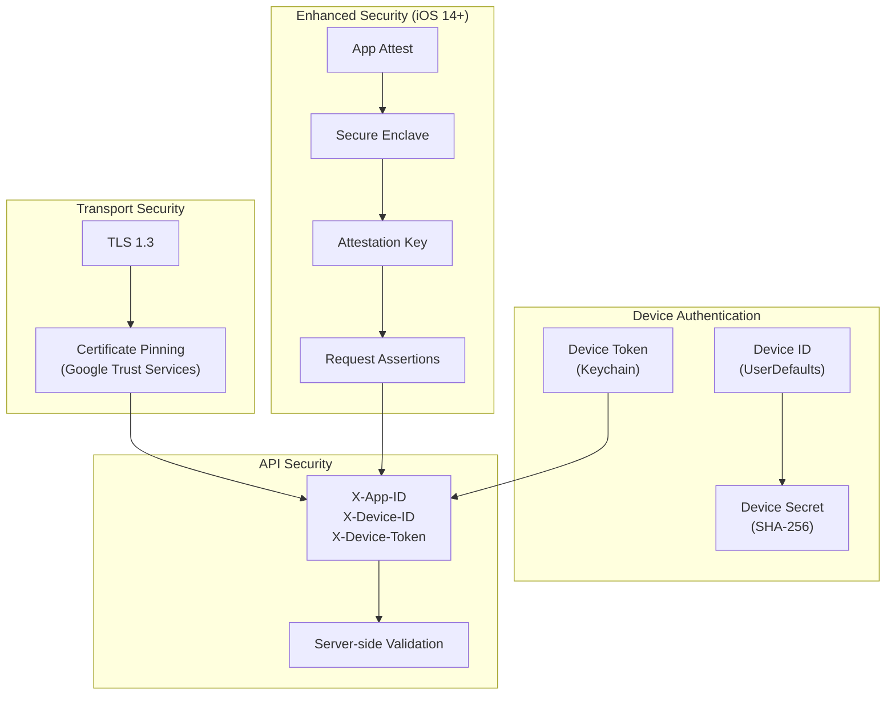
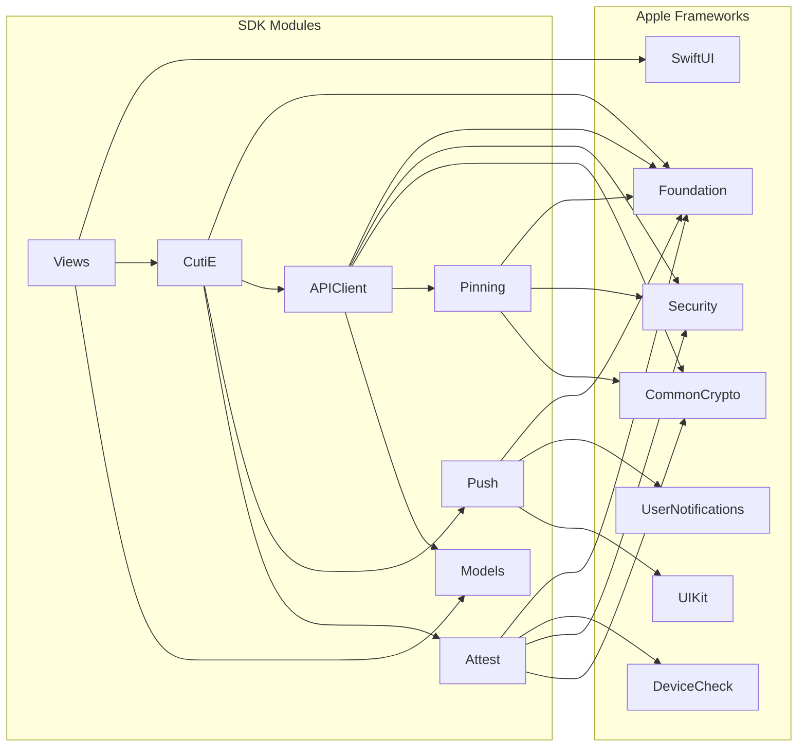

# Cuti-E iOS SDK Architecture

This document describes the architecture of the Cuti-E iOS SDK using C4 diagrams.

## C4 Model Overview

The C4 model provides four levels of abstraction:
1. **Context** - System landscape and external dependencies
2. **Container** - High-level technology choices
3. **Component** - Internal structure of containers

---

## Level 1: System Context

Shows how the SDK fits into the broader ecosystem.



### Simplified Context View



---

## Level 2: Container Diagram

Shows the SDK as a Swift Package with its main modules.



---

## Level 3: Component Diagram

Shows the internal structure and relationships between SDK components.



---

## Data Flow Diagrams

### Conversation Creation Flow



### Push Notification Flow



### App Attest Flow



### Device Linking Flow



---

## Security Architecture



---

## Module Dependencies



---

## Platform Requirements

| Component | Minimum iOS | Minimum macOS | Notes |
|-----------|-------------|---------------|-------|
| Core SDK | 15.0 | 12.0 | Base functionality |
| Push Notifications | 10.0 | 10.14 | `UserNotifications` |
| App Attest | 14.0 | 11.0 | `DeviceCheck` |
| Async/Await APIs | 15.0 | 12.0 | Swift concurrency |
| SwiftUI Views | 15.0 | 12.0 | `CutiEInboxView`, etc. |

---

## File Structure

```
Sources/CutiE/
├── CutiE.swift                    # Main entry point, configuration
├── CutiEAPIClient.swift           # HTTP client, device auth
├── CutiEAppAttest.swift           # Apple App Attest integration
├── CutiECertificatePinning.swift  # SSL certificate pinning
├── CutiEFeedbackView.swift        # Feedback form (SwiftUI)
├── CutiEPushNotifications.swift   # APNs integration
├── CutiESubscriptionManager.swift # StoreKit subscriptions
├── Models.swift                   # Data models
└── Views/
    ├── CutiEInboxView.swift       # Conversation list
    └── CutiEConversationView.swift # Message thread
```
